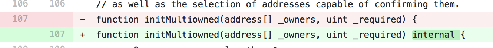
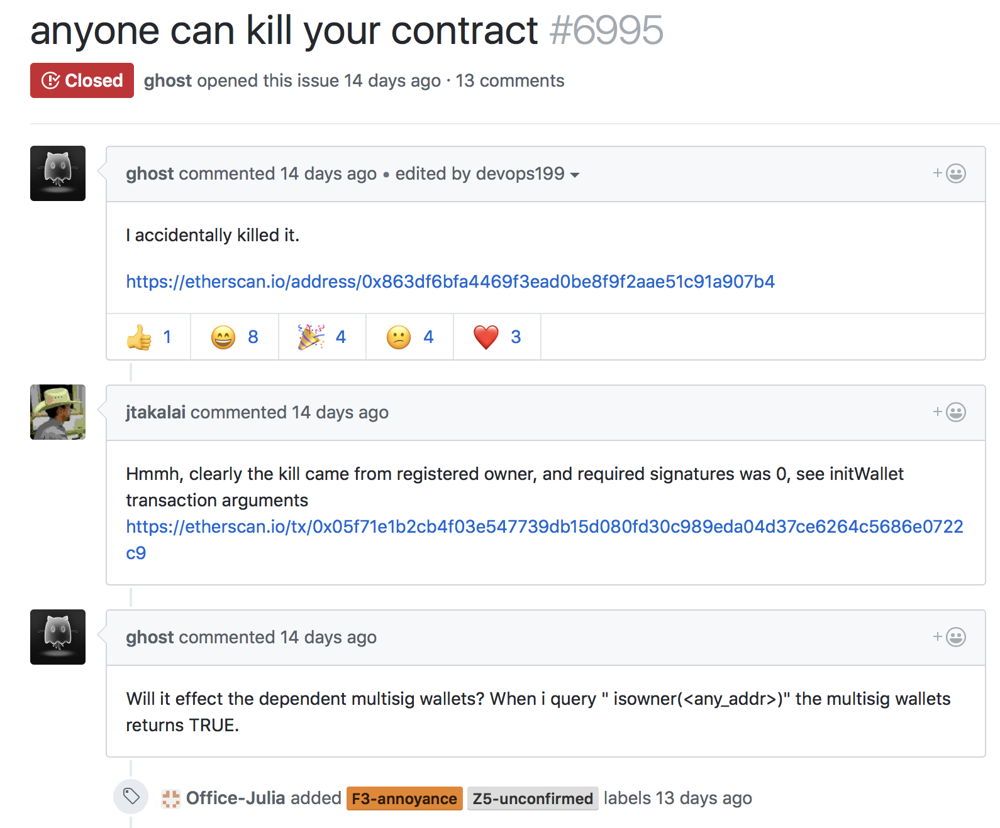
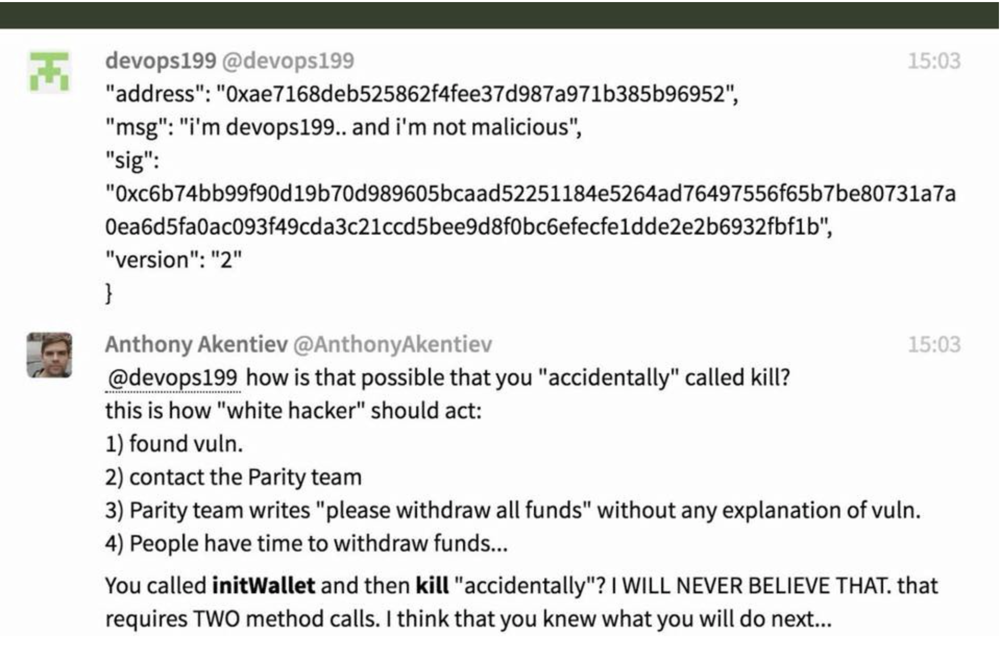

### BeerBash
### 2017/11/20
### 怖いスマートコントラクト
### Shinohara Wataru

---

### 私

- ビッグデータ部
- レコメンドチーム
  - Kubernetes
  - Spinnaker
  - Istio
- Scala / Haskell / PureScript / Golang
- Blockchain, Ethereum

---

### Ethereum

- 分散アプリケーションのプラットフォーム
- ビットコインの次に規模が大きい
- スマートコントラクトを動かせる

---

### スマートコントラクト

- 自動契約
- Ethereumで動作するプログラム
- 送金もそれ以外もなんでもできる

---

### 作り方

- プログラムを書く
- ブロックチェーンにデプロイする
- ☺️

---

### 利点

- チューリング完全
- 状態を持つことができる
- 自由度が高い

---

### 問題

- 止める仕組みを入れないと止められない
- 消すように作らないと消せない
- デプロイしたら変更できない
- そのコード、正しく動きますか

---

### トレードオフ

- 自由度⤴️
- バグの危険性⤴️

---

### 本当にあった怖い話

- The DAO事件
- 2017 Parityのバグ⛱
- 2017 Parityのバグ⛄️

---

### The DAO

- The DAO = クラウドファンディングみたいなやつ
- 非中央集権
- 2016年6月17日
- 当時の金額で約52億円が盗難にあう

---

### The DAO #1

splitDAO

- DAOに賛同しない場合に、新しいDAOを作成する機能を利用
- DAOの自分の残高 🏦
- 新しいDAOの残高 🏠
- 送金処理を行って完了したら残高を0にする

🏦 → 💰 → 🏠

---

### The DAO #2

withdrawRewardFor

- splitDAOの中で呼び出される
- 🏦の残高を🏠にDAOから1度だけ送金する処理
- DAOの残高 🏢
- 送金自体はDAOそのものから送金されている
- 前述の処理を再帰で呼び出せる
- その状態で残高は減っていない

🏢 → 💰 → 🏠  
　🏦 → 💰 → 🏠    

```text
コミュニティは後で治すことにした
```

---

### The DAO
#### 何が起きたか

🏢 → 💰 → 🏠  
　🏦 → 💰 → 🏠    
　　🏢 → 💰 → 🏠  
　　　🏦 → 💰 → 🏠    
　　　　🏢 → 💰 → 🏠  
　　　　　🏦 → 💰 → 🏠    
...

**🏢 → (🏦💰) * 30 → 🏠**

---

### The DAO
#### どうやって解決したか

- 新しく作成したDAOの資金は27日間動かせない
- 攻撃された歴史を巻き戻して無かったことにした
- Ethereumのコミュニティが分裂した

🙆 → Ethereum  
🙅‍♂️ → Ethereum Classic

---

### 2017 Parityのバグ⛱

- マルチシグウォレットに不具合
- サードパーティのParityが開発
- ウォレットの初期化メソッドが呼べる
- オーナー権限が奪われる
- 攻撃アカウントにウォレットの全額を送金

<!-- .element height="60%" width="60%" -->

**34億円の被害**

---

### 2017 Parityのバグ⛱
#### どうやって解決したか

- 解決せず
- 80億円はホワイトハッカーが保護

---

### 2017 Parityのバグ⛄

- マルチシグウォレットに不具合
- 利用しているライブラリが初期化されていない
- 初期化されていないと初期化メソッドが呼べる
- ライブラリのオーナー権限が奪われる
- ライブラリの削除メソッドがある、かつ呼べる
- ウォレットがすべて使えなくなった

**300億円凍結**

---

### 2017 Parityのバグ⛄
#### devops199

<!-- .element height="60%" width="60%" -->

---

### 2017 Parityのバグ⛄
#### devops199

<!-- .element height="60%" width="60%" -->

---

### 2017 Parityのバグ⛄
#### どうやって解決したか

- 解決策模索中
- 凍結した場合の資金を過去の取引からユーザーに返す実装などが提案されている

---

### まとめ

- Ethereumは悪くない
- とはいえプログラムにバグはつきもの
- テストフレームワークを使う

---

### まとめ

- まだナレッジが溜まってない
- コードは気をつけよう
- ユーザーに不利益を与えないように

